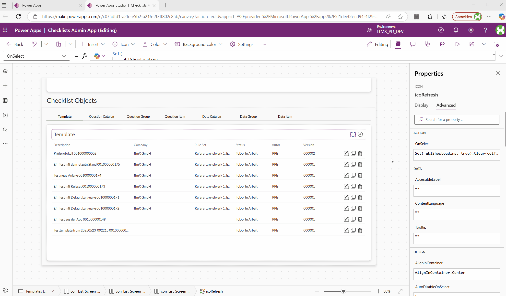

# PowerApps AI Commenter

A browser extension that helps you add AI-generated comments to your PowerApps code using OpenAI models.

## Features
- AI-powered code commenting (default: GPT-4.1-mini)
- Simple popup UI: paste code, get comments, copy result
- Works with any OpenAI-compatible endpoint
- Fast, lightweight, and easy to configure

## Demo

See it in action:

## Installation

There are two ways to install the extension:

1. **Use the packed extension:** Download the latest release from GitHub, then drag & drop the `.crx` file into your browser's extensions page.
2. **Load unpacked source code:** Download the source code from GitHub, then use "Load unpacked" in the extensions page (requires Developer Mode enabled).

## How to Use
1. Right-click the extension icon > Options. Enter your OpenAI API key, endpoint, and model name. Save.
2. In PowerApps, copy your code.
3. Click the "💬 Comment with AI" button in the toolbar.
4. Paste your code into the popup, click "Comment with AI".
5. Copy the commented code back to your editor.